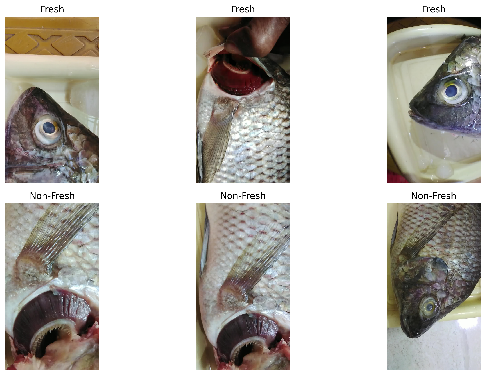
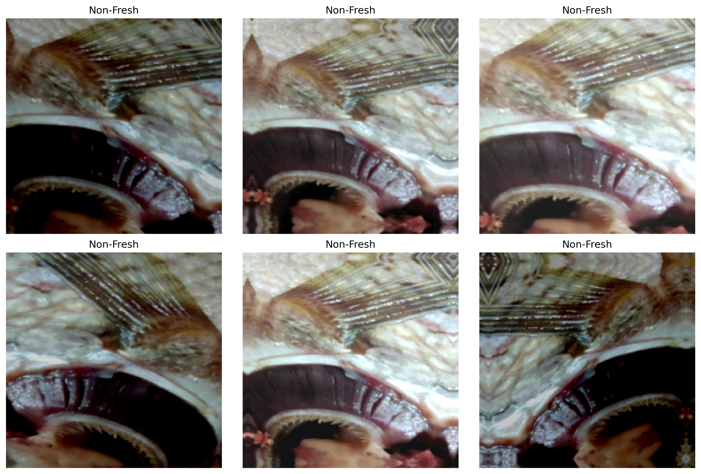
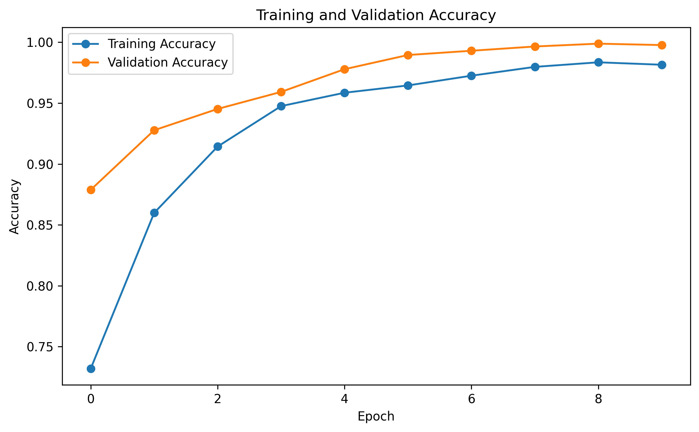
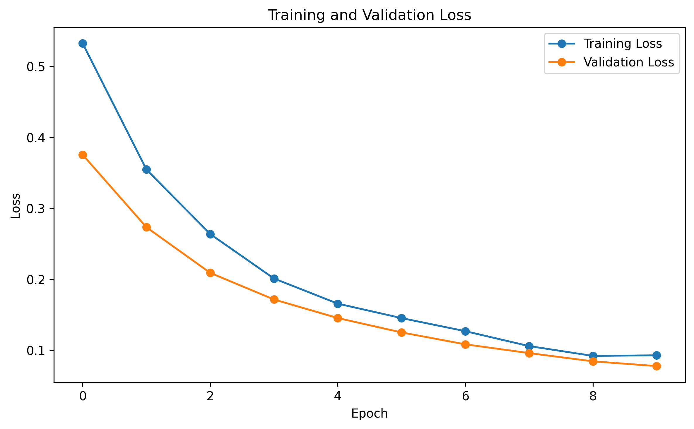
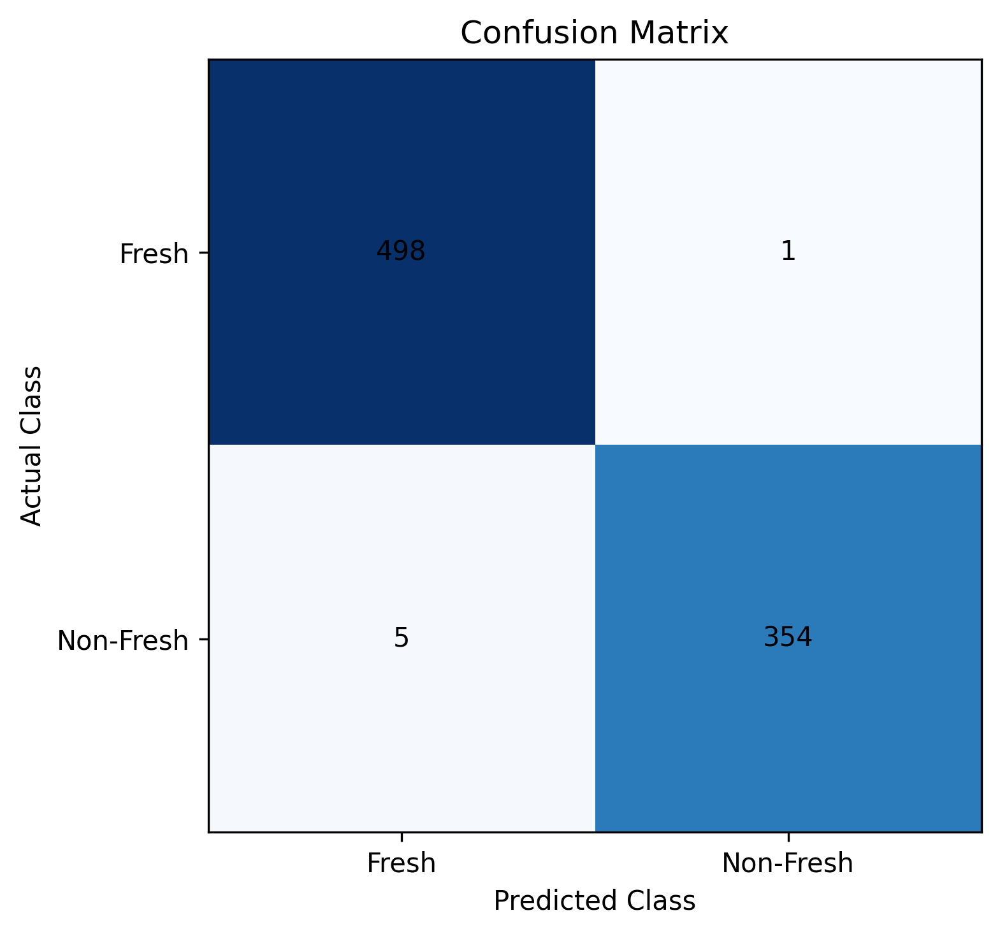
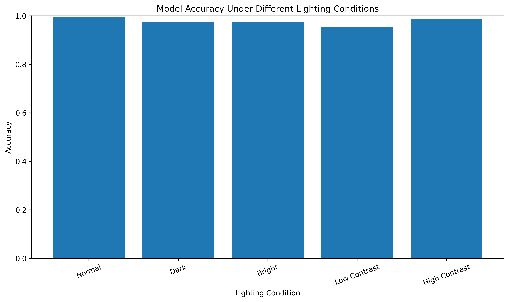
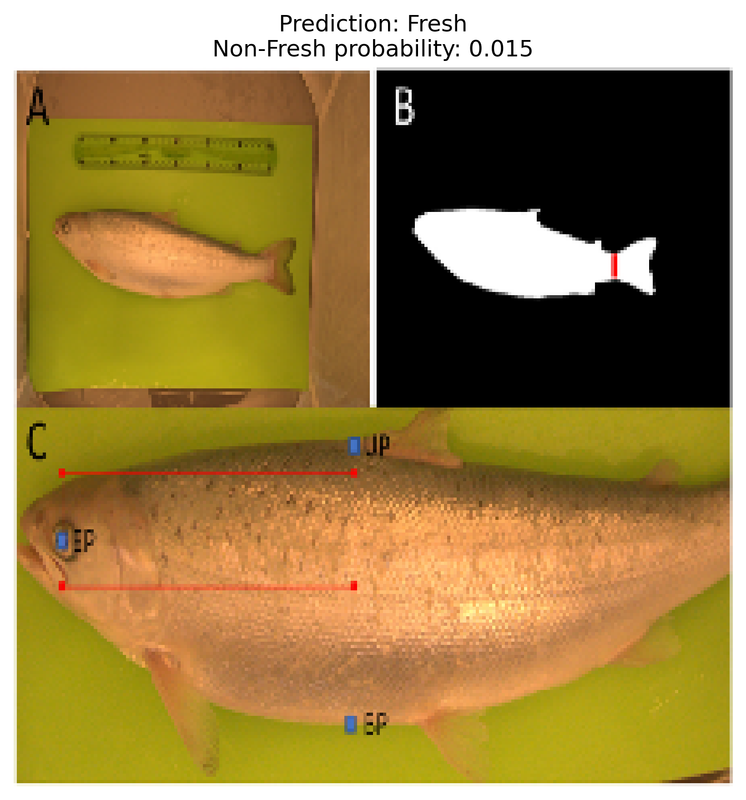

# Machine_Learning-Project-October
Machine_Learning_Project_Retake

# Fish Freshness Classification Under Lighting Variations Using MobileNetV2

## 1. Project Overview

This project implements a deep learning-based image classification system to classify fish images into two categories: **Fresh** and **Non-Fresh**. The model uses transfer learning with MobileNetV2 pretrained on ImageNet.

The project also investigates how different lighting conditions affect the classification performance of the trained model. Brightness and contrast transformations are applied to test images to evaluate the model's robustness under variations in image appearance.

The complete implementation, including data preparation, preprocessing, model training, evaluation, and lighting variation experiments, is available in the Jupyter Notebook linked below.

## 2. Project Code

**GitHub Repository:**
https://github.com/rohankush444/Machine_Learning-Project-October

**Complete Jupyter Notebook:**
[Fish Freshness Classification Under Lighting Variations Using MobileNetV2]
(https://github.com/rohankush444/Machine_Learning-Project-October/blob/main/Fish_Freshness_Classification_Under_Lighting_Variations_Using_MobileNetV2.ipynb)

The notebook contains the complete project implementation, including:

* Dataset loading and image indexing
* Image preprocessing and augmentation
* Training, validation, and testing data splitting
* MobileNetV2 transfer learning
* Model training and checkpointing
* Performance evaluation and confusion matrix
* Lighting variation experiments
* Prediction examples and result visualizations
* Saving the trained model and experimental results
* ## Dataset Access and Setup

The project uses a fish image dataset containing two classes: **Fresh** and **Non-Fresh**.

**Dataset download link:** **Dataset Source:** [Download the Fish Dataset](https://www.kaggle.com/datasets/haripriyasanga/tilapia-fish-fresh-and-non-fresh-species)
The dataset ZIP file must be downloaded separately before running the project. It is not included in the GitHub repository unless explicitly uploaded.

### Steps to Access the Dataset

1. Open the dataset download link above.
2. Download the fish image dataset ZIP file to your computer.
3. Open the [project Jupyter Notebook](https://github.com/rohankush444/Machine_Learning-Project-October/blob/main/Fish_Freshness_Classification_Under_Lighting_Variations_Using_MobileNetV2.ipynb).
4. Download the notebook and open it in [Google Colab](https://colab.research.google.com/).
5. Run the dataset upload cell.
6. When the file-selection window appears, select the downloaded dataset ZIP file.
7. Run the extraction and preprocessing cells.
8. Continue running the notebook cells in order to train and evaluate the model.

### Expected Dataset Structure

After extraction, the notebook expects the images to be organized into class folders similar to the following:

```text
fish_dataset/
└── Kaggle_upload/
    ├── Fresh/
    └── Non-Fresh/
```

The actual folder names must match the dataset and the paths configured in the notebook. If the extracted structure differs, update the dataset path accordingly.

### Important Notes

* Do not upload private API keys, passwords, or credentials to GitHub.
* If using a Google Drive link, ensure that your professor has permission to access the file.
* If using Kaggle, provide the original dataset page URL and follow its access and licensing requirements.
* Keep the notebook and dataset links accessible so the project can be reproduced.


## 3. Project Objectives

* Develop an image classification model for Fresh and Non-Fresh fish images.
* Apply transfer learning using MobileNetV2.
* Improve model generalization through image augmentation.
* Evaluate classification performance on an independent test set.
* Analyze the impact of brightness and contrast variations.
* Visualize training performance and classification results.
* Provide a reproducible workflow using Google Colab.

## 4. Technologies and Libraries

* Python
* Google Colab
* TensorFlow and Keras
* MobileNetV2
* NumPy
* Pandas
* Matplotlib
* Scikit-learn
* GitHub and Jupyter Notebook

## 5. Dataset Description

The dataset contains fish images belonging to two classes:

1. **Fresh**
2. **Non-Fresh**

The notebook indexes the image paths and their corresponding labels. The images are resized and prepared for model training.

### Dataset Source and Access

**Original dataset download link:** [Insert the original dataset URL here]

The dataset is not assumed to be included in this GitHub repository. Obtain it from the original source before running the notebook.

If the dataset is supplied as a ZIP file, keep it on your computer so you can upload it when the notebook prompts you.

### Expected Dataset Structure

The notebook expects the extracted images to be organized into class folders. An example structure is:

```text
fish_dataset/
└── Kaggle_upload/
    ├── Fresh/
    │   ├── image1.jpg
    │   ├── image2.jpg
    │   └── ...
    └── Non-Fresh/
        ├── image1.jpg
        ├── image2.jpg
        └── ...
```

The actual folder names and structure must match the dataset and the path configuration in the notebook. Adjust the path if your downloaded dataset has a different structure.

### Dataset Split

The dataset is divided into three subsets using stratified sampling.

| Subset     | Percentage |
| ---------- | ---------: |
| Training   |        70% |
| Validation |        15% |
| Testing    |        15% |

The split uses `random_state=42` to support reproducibility.

## 6. How to Open and Run the Project

The recommended way to run the project is with Google Colab. This avoids having to configure a complete local Python environment.

### Step 1: Open the Notebook

Open the complete project notebook from GitHub:

[Open the Project Notebook](https://github.com/rohankush444/Machine_Learning-Project-October/blob/main/Fish_Freshness_Classification_Under_Lighting_Variations_Using_MobileNetV2.ipynb)

### Step 2: Download the Notebook

On the GitHub notebook page, use the download or raw-file option to save the `.ipynb` file to your computer.

### Step 3: Open Google Colab

Go to [Google Colab](https://colab.research.google.com/).

1. Select **File**.
2. Choose **Upload notebook**.
3. Upload the downloaded `.ipynb` file.

### Step 4: Select the Runtime

In Google Colab, select a runtime with sufficient memory. A GPU runtime is recommended to speed up model training, but availability depends on your Colab account and current resources.

### Step 5: Upload the Dataset

Run the notebook's dataset upload cell. When the file-selection window appears:

1. Select the fish dataset ZIP file.
2. Wait for the upload to finish.
3. Run the extraction cell.
4. Verify that the extracted images are located at the path expected by the notebook.

**Important:** Upload the fish dataset ZIP file when prompted. Do not upload a Kaggle API token unless you have intentionally changed the notebook to download data through the Kaggle API.

### Step 6: Execute the Notebook

Run the cells sequentially, starting with dataset upload and extraction and continuing through preprocessing, training, evaluation, and lighting experiments.

Wait for each cell to finish before moving to the next one.

### Step 7: Review the Results

After execution, review the model's test metrics, classification report, confusion matrix, training curves, lighting variation results, and example predictions.

## 7. Data Preprocessing and Augmentation

The notebook applies the following preprocessing steps:

* Image resizing to 224 × 224 pixels
* Label assignment for Fresh and Non-Fresh classes
* Stratified train, validation, and test splitting
* MobileNetV2-specific image preprocessing
* Batch processing with a batch size of 32

The training pipeline also uses image augmentation:

* Random horizontal flipping
* Random rotation
* Random zoom
* Random contrast adjustment
* Random brightness adjustment

These transformations help expose the model to image variations during training.

## 8. Model Architecture

The project uses MobileNetV2 pretrained on ImageNet as the feature extraction backbone.

The classification architecture consists of:

1. MobileNetV2 with the pretrained ImageNet weights
2. Global Average Pooling
3. Dropout with a rate of 0.3
4. A sigmoid output layer for binary classification

The pretrained MobileNetV2 base is initially frozen during training.

The model produces a probability for the Non-Fresh class. A threshold of 0.5 is used to assign the predicted class.

## 9. Model Training Configuration

| Parameter          | Configuration                               |
| ------------------ | ------------------------------------------- |
| Model              | MobileNetV2                                 |
| Pretrained weights | ImageNet                                    |
| Input image size   | 224 × 224                                   |
| Batch size         | 32                                          |
| Maximum epochs     | 10                                          |
| Optimizer          | Adam                                        |
| Learning rate      | 0.0001                                      |
| Loss function      | Binary cross-entropy                        |
| Output activation  | Sigmoid                                     |
| Dropout rate       | 0.3                                         |
| Data split         | 70% / 15% / 15%                             |
| Random state       | 42                                          |
| Model checkpoint   | Monitors validation loss                    |
| Early stopping     | Patience of 3 epochs; restores best weights |

The model checkpoint saves the best-performing model according to validation loss. Early stopping helps prevent unnecessary training when validation performance stops improving.

## 10. Evaluation Metrics

The trained model is evaluated using:

* **Accuracy:** Proportion of correctly classified images.
* **Precision:** Proportion of predicted positive cases that are correct.
* **Recall:** Proportion of actual positive cases correctly identified.
* **F1-score:** Harmonic mean of precision and recall.
* **Confusion matrix:** Shows correct and incorrect predictions for each class.
* **Test loss:** Measures the model's classification loss on the test set.

For the binary classification metrics generated by the notebook, Non-Fresh is the positive class for precision, recall, and F1-score.

## 11. Experimental Results

The following values are from the reported notebook results.

### Test Set Performance

| Metric                |   Result |
| --------------------- | -------: |
| Number of test images |      858 |
| Test loss             | 0.074527 |
| Test accuracy         |   99.30% |

### Classification Report

| Class            | Precision | Recall | F1-score | Support |
| ---------------- | --------: | -----: | -------: | ------: |
| Fresh            |    0.9901 | 0.9980 |   0.9940 |     499 |
| Non-Fresh        |    0.9972 | 0.9861 |   0.9916 |     359 |
| Macro average    |    0.9936 | 0.9920 |   0.9928 |     858 |
| Weighted average |    0.9930 | 0.9930 |   0.9930 |     858 |

### Lighting Variation Experiment

The trained model is evaluated under five conditions: Normal, Dark, Bright, Low Contrast, and High Contrast.

| Condition     | Accuracy | Precision | Recall | F1-score |
| ------------- | -------: | --------: | -----: | -------: |
| Normal        |   99.30% |    99.72% | 98.61% |   99.16% |
| Dark          |   97.44% |    98.84% | 94.99% |   96.88% |
| Bright        |   97.55% |   100.00% | 94.15% |   96.99% |
| Low Contrast  |   95.45% |    99.69% | 89.42% |   94.27% |
| High Contrast |   98.60% |   100.00% | 96.66% |   98.30% |

The results indicate that classification performance changes under different lighting conditions. Low contrast produces the largest accuracy reduction among the tested conditions.

These results apply to the dataset and experimental setup used in this project. They do not guarantee equivalent performance on all fish species, cameras, or real-world environments.

## 12. Generated Outputs

The notebook generates the following files during execution, provided the corresponding cells run successfully.

| Output file                        | Purpose                               |
| ---------------------------------- | ------------------------------------- |
| `fish_image_index.csv`             | Image paths and labels                |
| `dataset_distribution.png`         | Dataset class distribution            |
| `sample_fish_images.png`           | Sample images from the dataset        |
| `lighting_variations.png`          | Examples of lighting transformations  |
| `training_validation_accuracy.png` | Training and validation accuracy      |
| `training_validation_loss.png`     | Training and validation loss          |
| `confusion_matrix.png`             | Test-set confusion matrix             |
| `lighting_variation_results.csv`   | Metrics for lighting conditions       |
| `lighting_accuracy_comparison.png` | Accuracy comparison across conditions |
| `Fish_Freshness_MobileNetV2.keras` | Saved trained model                   |
| `test_prediction.png`              | Example prediction visualization      |

These are generated outputs; their presence in the GitHub repository depends on whether you upload them after running the notebook.

## 13. Suggested Repository Structure

The repository can be organized as follows:

```text
Machine_Learning-Project-October/
├── README.md
├── Fish_Freshness_Classification_Under_Lighting_Variations_Using_MobileNetV2.ipynb
├── results/
│   ├── dataset_distribution.png
│   ├── sample_fish_images.png
│   ├── lighting_variations.png
│   ├── training_validation_accuracy.png
│   ├── training_validation_loss.png
│   ├── confusion_matrix.png
│   ├── lighting_accuracy_comparison.png
│   └── test_prediction.png
├── fish_image_index.csv
└── lighting_variation_results.csv
```

This is a suggested structure, not a claim that every listed file is already uploaded. Include only the files that exist. The dataset ZIP file and trained model can be stored separately if they are too large or subject to licensing restrictions.

## Project Results and Visualizations

### 1. Dataset Distribution
.png)

### 2. Sample Fish Images


### 3. Lighting Variations


### 4. Training and Validation Accuracy


### 5. Training and Validation Loss


### 6. Confusion Matrix


### 7. Lighting Accuracy Comparison


### 8. Example Test Prediction


## 14. Limitations

* The model is evaluated on a particular dataset and may not generalize to all fish species.
* Artificial lighting transformations do not represent every real-world lighting condition.
* Image quality, class balance, and dataset diversity can influence performance.
* Further validation on independent datasets is needed to assess generalization.
* This model is an academic image classification experiment and should not be treated as a standalone food-safety assessment.

## 15. Future Improvements

Possible future improvements include:

* Testing the model on independent datasets.
* Evaluating more diverse lighting and camera conditions.
* Fine-tuning selected MobileNetV2 layers.
* Applying explainability techniques such as Grad-CAM.
* Developing a web application for image upload and prediction.
* Evaluating performance across different fish species and capture environments.

## 16. Conclusion

This project demonstrates a transfer-learning approach to classifying fish images as Fresh or Non-Fresh using MobileNetV2. The reported test accuracy is 99.30% on 858 test images.

The lighting variation experiments show that model performance can decrease when image brightness and contrast change, with low contrast producing the largest reduction among the conditions tested.

The notebook provides the implementation for data preparation, training, evaluation, and lighting robustness experiments. The dataset must be obtained separately unless it is explicitly included in the repository.

## 17. Academic Project Information

* **Project title:** Fish Freshness Classification Under Lighting Variations Using MobileNetV2
* **Program:** Master of Science in Data Science
* **Institution:** University of Europe for Applied Sciences
* **Course:** Machine Learning
* **Student name:** [Rohan Kushwaha]
* **Student ID:** [35464835]

## 18. Reproducibility Note

To reproduce the project, use the linked notebook, obtain the dataset from its original source, upload the dataset ZIP file in Google Colab, and execute the notebook cells in order.

Results may vary depending on the dataset version, software environment, hardware, and random operations. The reported values in this README should be checked against the final executed notebook before submission.
